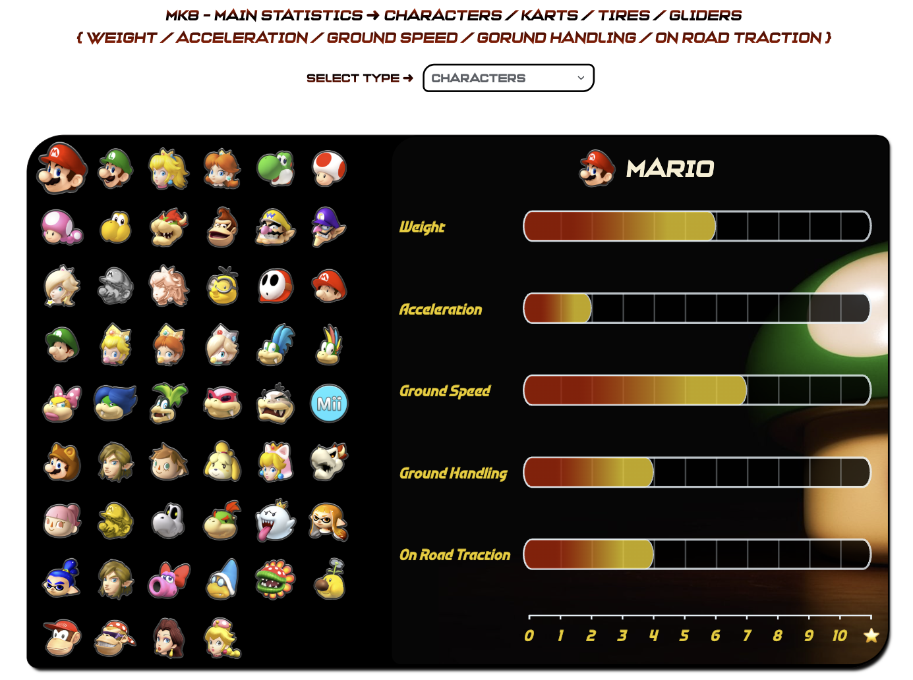
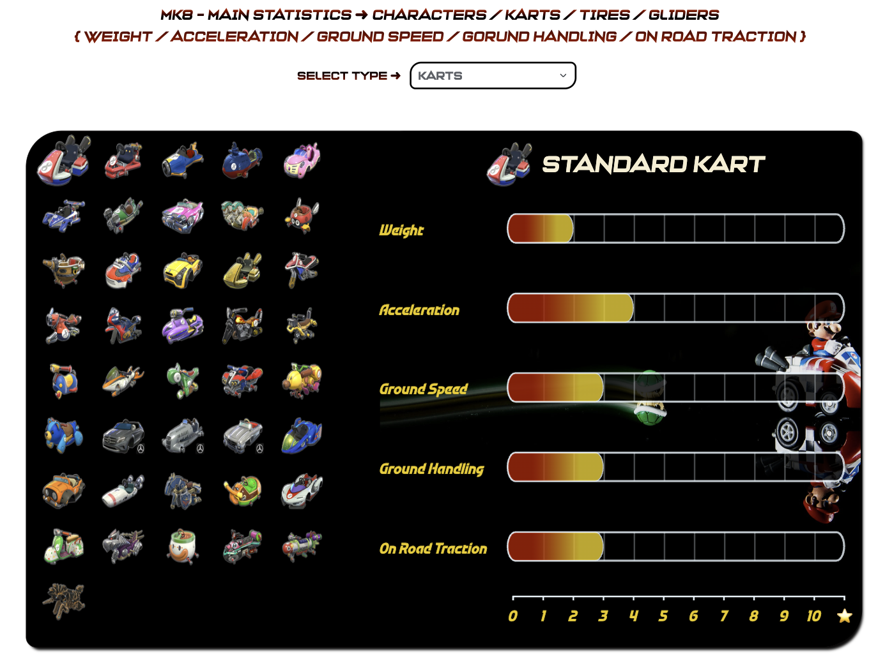
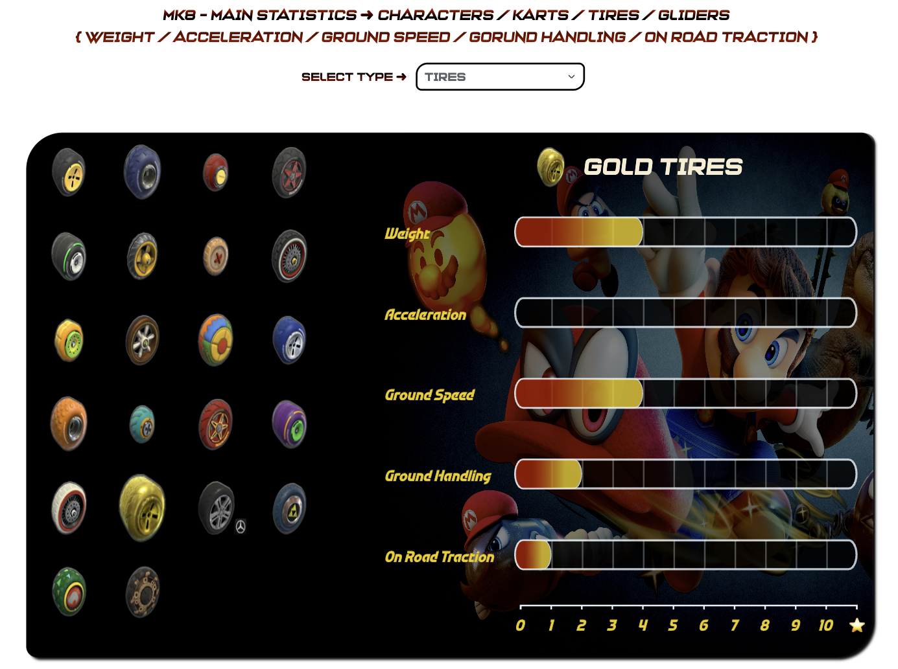
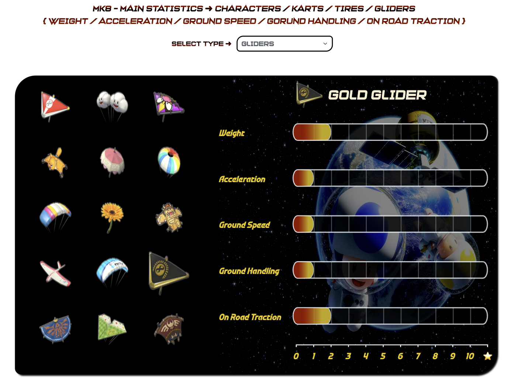
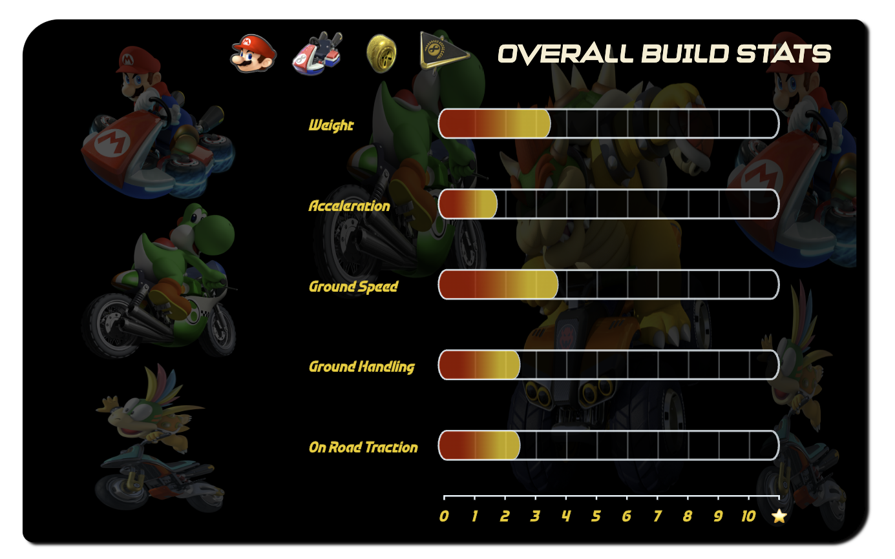
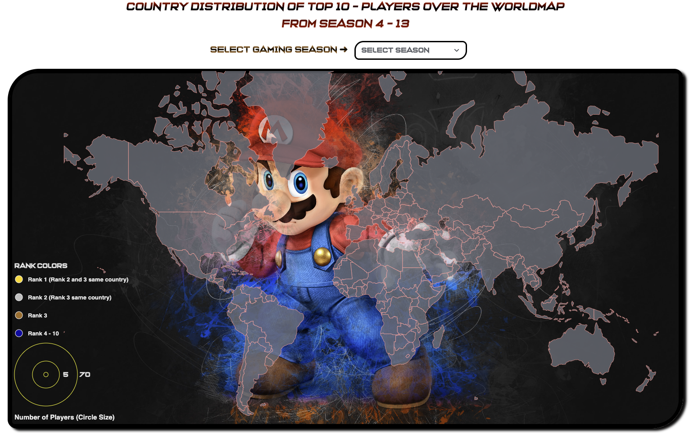

# Mario Kart 8 Deluxe Scrollytelling

An interactive data visualization experience exploring the gameplay mechanics, statistics, history, and competitive landscape of **Mario Kart 8 Deluxe** through a narrative-driven scrollytelling interface.

Developed as a five-person team project for **CSE 578: Data Visualization at Arizona State University**.

## Live Demo

**Best viewed on desktop. This visualization was designed for a desktop scrollytelling experience. [Explore the Interactive Visualization](https://yuwinsiriwardhane.github.io/mario-kart-deluxe-8-scrollytelling/)**

---

## Overview

Mario Kart 8 Deluxe contains a large number of visible and hidden statistics that influence how characters, vehicles, and other components perform during a race.

This project transforms those statistics and competitive racing data into an interactive scrollytelling experience designed to demonstrate the depth behind the game's mechanics.

The narrative progresses through three primary areas:

- **History & Evolution** — explores Mario Kart's history, game ratings, and sales within the racing-game genre.
- **Gameplay Mechanics** — explores character and vehicle statistics, weight categories, item probabilities, hidden attributes, and racer configurations.
- **Competitive Racing** — explores competitive-player distributions and the evolution of world-record race times.

The application combines interactive D3.js visualizations, data wrangling, animations, filtering, and scroll-based transitions to guide users through the data.

---

## Technologies

- **HTML**
- **SCSS / CSS**
- **JavaScript**
- **D3.js**
- **ScrollMagic**
- **Data Visualization**
- **Data Wrangling**

---

## Key Features

### Interactive Racer Configuration

One of the project's two custom visualizations is an interactive racer configuration interface inspired by the Mario Kart 8 Deluxe vehicle-selection screen.

Users can independently select:

- Characters
- Karts
- Tires
- Gliders

The visualization dynamically updates the statistics associated with each component and calculates the aggregate statistics of the complete racer configuration.

Statistics visualized include:

- Speed
- Acceleration
- Weight
- Handling
- On-Road Traction

Multiple interconnected D3.js visualizations update dynamically as users experiment with different racer combinations.











### Competitive Player Distribution

An interactive geographic visualization displays the country distribution of top competitive Mario Kart players across multiple online seasons.

Users can filter the visualization by season to explore changes in the geographic distribution of competitive players.



### Interactive Data Exploration

The project incorporates several interaction techniques across its visualizations, including:

- Dynamic filtering
- Multi-level selections
- Animated transitions
- Tooltips
- Dropdown-based interactions
- Scroll-triggered animations
- Interactive geographic visualization

---

## My Contributions

My primary responsibilities focused on the **gameplay mechanics**, **competitive visualization**, and final application integration.

### Custom Racer Configuration Visualization

- Designed and implemented one of the project's **two custom D3.js visualizations**.
- Built an interactive Mario Kart racer configuration interface with multi-level selection across characters, karts, tires, and gliders.
- Developed **five interconnected D3.js visualizations** representing individual component statistics and aggregate racer-build statistics.
- Implemented dynamic updates that recalculate and visualize overall performance statistics based on the user's selected configuration.
- Designed the visualization to visually resemble the racer setup experience within Mario Kart 8 Deluxe.

### Competitive Player Visualization

- Developed an interactive geographic visualization showing the country distribution of top competitive players across multiple online seasons.
- Implemented season-based filtering through an interactive dropdown.
- Integrated the visualization with the Mario Kart visual theme.

### Data Preparation & Integration

- Collected and manually structured data required for my visualizations from multiple online sources.
- Performed data cleaning, formatting, and wrangling to transform raw information into visualization-ready datasets.
- Implemented scroll-triggered fade animations across sections of the application.
- Contributed to final application integration, styling, and project structure.

---

## Data Collection & Wrangling

One of the challenges of the project was that no single ready-made dataset contained all of the information required for the visualizations.

Data was gathered from multiple sources using a combination of:

- Manual data collection
- Web scraping
- Existing CSV datasets
- Data cleaning and transformation

Sources included Mario Kart community datasets, competitive leaderboards, world-record databases, gaming statistics websites, wikis, blogs, and forums.

The collected data was transformed into formats that could be consumed by the D3.js visualizations.

---

## Project Structure

```text
.
├── data/                  # Visualization datasets
├── images/                # Images and visualization assets
├── scripts/               # D3.js visualization logic
├── styles/                # Application styles
├── fonts/                 # Custom fonts
├── chart_backgrounds/     # Visualization backgrounds
├── track_pngs/            # Track assets
├── index.html             # Application entry point
├── main.js                # Main application logic
└── style.css              # Global styles
